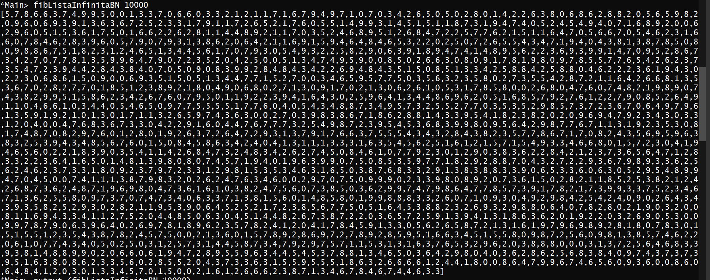

# Trabalho 1 - PFL
### Autores:
* Amanda Silva - [up201800698](https://sigarra.up.pt/feup/pt/fest_geral.cursos_list?pv_num_unico=201800698)
* Rafael Camelo - [up201907729](https://sigarra.up.pt/feup/pt/fest_geral.cursos_list?pv_num_unico=201907729)


## Fibonacci
 **fibRec**: A mais simples e mais intuitiva das funcoes de fibonacci é feita por recursão. A função `fibRec n` retorna `fibRec (n - 1) + fibRec (n - 2)`.
 
 **fibLista**: A função `fibLista` usa uma estratégia similiar à função de fibonacci recursiva, mas guarda os resultados parciais da sequência de fibonacci e usa-os para calcular o elemento seguinte até ao elemento pedido.
 
 **fibListaInfinita:**  Para a lista infinita tambem fazemos uma chamada recursiva aonde adicionamos com ``zipwith`` a lista e a sua ``tail``. É feita a soma de index n com index (n + 1) para obter o valor seguinte na sequência.
 
 * Testes Fib:
````ruby 
*Main> fibRec 10
55
*Main> fibLista 10
55
*Main> fibListaInfinita 10
55
```` 
````ruby 
*Main> fibRec 22
17711
*Main> fibLista 22
17711
*Main> fibListaInfinita 22
17711
```` 
* Testes fibBN:
````ruby 
*Main> fibRecBN 22
 [1,1,7,7,1]
*Main> fibListaBN 22
 [1,1,7,7,1]
*Main> fibListaInfinitaBN 22
 [1,1,7,7,1]
```` 
## BigNumbers

### SomaBN e SubNB

Primeiro, observamos que uma função que soma dois inteiros pode ser expressa por meio de duas outras funções que lidam apenas com valores absolutos:

1. uma função que adiciona dois inteiros.
2. uma função que subtrai um interio a outro.

É possível porque:
 
>  |a| + |b| = |a| + b
>
>  −|a| + (−|b|) = −(|a| + b) 
>
>  |a| + (−|b|) = |a| − |b|
>
>  −|a| + |b| = |b| − |a|


**SomaBN** - Para fazer a adição o melhor método é o de adição de colunas (método aprendido no primário) 
Pegamos no dígito menos significativo do primeiro *BigNumber*, pegamos no dígito menos significativo do segundo *BigNumber*, somamos com o carry (na primeira iteração carry está com o valor 0), se a adição for maior que 10 o carry da chamda recursiva terá o valor 1 caso contrário terá o valor 0 (``resultado / 10``). A função é chamada recursivamente até chegar ao último digito da lista.


Testes SomaBN:
````ruby 
output (somaBN [1, 2, 3] [3, 2, 1]) == "444"
True

output (somaBN [9, 9, 9] [9, 9, 9, 9]) == "10998"
True

output (somaBN [9, 9, -9] [9, 9, 9, 9]) == "9000"
True

output (somaBN [9, 9, 9] [9, 9, 9, -9]) == "-9000"
True

output (somaBN [9, 9, -9] [9, 9, 9, -9]) == "-10998"
True
```` 


**SubBN** - A função de subtração é muito semelhante a de adição. Utilizamos o método de colunas. Caso o resultado da subtração: ``a - b - carry`` for menor que zero o *carry* teria valor 1, adicionamos a lista o seguinte valor: ``10 + (a - b - carry)`` e chamamos a função recursivamente para o resto dos *BigNumber*s da subtração.

Testes SubBN:
````ruby
output (subBN [1, 2, 3] [3, 2, 1]) == "198" 
True

output (subBN [9, 9, 9] [9, 9, 9, 9]) == "-9000"
True

output (subBN [9, 9, -9] [9, 9, 9, -9]) == "9000"
True

output (subBN [9, 9, 9] [9, 9, 9, -9]) == "10998"
True
```` 
### MulBN

No caso da multiplicação, tomamos inspiração da `somaBN` e dividimos a multiplicação em dois casos:
 1. No primeiro caso, ambos elementos são positivos ou ambos são negativos, assim o resultado será sempre positivo, logo podemos converter, caso seja necessário, os números em positivos, através da função ``toPos`` que usa a função `abs` do haskell.
 2. Num segundo caso, um dos elementos é negativo e o outro positivo, para calcular o produto de dois números com sinais diferentes calculamos o produto dos mesmos com sinal positivo e convertamos o resultado em negativo.


De seguida, tendo a garantia de que os números estão positivos separamos o processo em três partes:

1. Multiplicamos o digito menos significativo do segundo número (**y**)  pelo primeiro número por completo (**xs**). Usamos uma estratégia de guardar um valor **carry** e soma-lo à multiplicação de y pelo primeiro elemento de xs (**x**), de seguida damos *append* ao inicio do novo *BigNumber* o resto da divisão por 10 do valor calculado anteriormente, isto é `(carry + y * x) mod 10` e chamamos a mesma função recursivamente para o resto de xs atualizando o carry para `(carry + y * x) div 10`
2. Fazemos o ponto 1. para todos os elementos do segundo número (**ys**) multiplicando-os pelo exponencial de 10 à sua posição, pois os *BigNumbers* estão guardados de forma inversa, isto é, multiplicamos o elementos das unidades de ys por 1, o elemento das dezenas por 10, o das centenas por 100, o dos milhares por 1000 e assim até ao último elemento de ys.
3. Utilizamos a função `somaBN` para somar todos os *BigNumbers* obtidos em 2. de forma recursiva.

````ruby
*Main> 248 * 357
88536
*Main> output(mulBN (scanner "248") (scanner "357"))
"88536"
*Main> output(mulBN (scanner "-248") (scanner "357"))
"-88536"
*Main> 678 * 123
83394
*Main> output(mulBN (scanner "678") (scanner "-123"))
"-83394"
*Main> output(mulBN (scanner "-678") (scanner "-123"))
"83394"
````
### DivBN
 Para a divisão optamos utilizar o métododo de divisão por subtração repetida. Onde o valor do Denominador é subtraido do Resto e 1 é adicionado ao quociente até o Resto ser Menor ou Igual ao Denomindor.
 Exemplo: 

 > 38 dividido por 5:
 >  * **1.** 38 - 5 = 33
 >  * **2.** 33 - 5 = 28
 >  * **3.** 28 - 5 = 23
 >  * **4.** 23 - 5 = 18
 >  * **5.** 18 - 5 = 13
 >  * **6.** 13 - 5 = 8
 >  * **7.** 8 - 5 = 3 
 >
 >
 >  **Resultado:** Quociente = 7 Resto = 3 

Testes DivBN:

````ruby
*Main> divBN [5] [1]
([5], [])

*Main> divBN [0, 0, 3] [5, 1]
([0, 2], [0])

*Main> divBN [4, 1, 3] [5, 1]
([0, 2], [4, 1])

*Main> divBN [4, 1, 3] [5, -1]
([0, -2], [4, 1])

*Main> divBN [4, 1, -3] [5, -1]
([0, 2],[4, 1])
````

### Eficiência das funções Fib

Para os testes seguintes deixamos as funções correr durante um máximo de 10 segundos.

**FibRec e FibRecBN**:

O maior valor que a função *fibRec* conseguiu retornar em 10s ``5702887``. Para a função *fibRecBN* foi o valor ``[9,6,2,6,4,3,1]``, isto é ``1346269`` em decimal.

Assim consegue-se perceber que a implementação dos operadores do type *BigNumber* não são sempre as mais eficientea.

```ruby
*Main> fibRec 34
5702887
*Main> fibRec 31
1346269
```

**fibLista e fibListaBN**:

O maior valor que a função *fibLista* conseguiu retornar em 10s foi ``832040``. Para a função *fibListaBN* foi o valor ``[0,4,0,2,3,8]``, isto é ``832040`` em decimal.

Neste caso a implementação com *BigNumber* foi tão rápida como a que usa apenas inteirios. Detalhe importante, apesar de trabalhar com listas a função `fibLista` foi mais lenta que a `fibRec`.

```ruby
*Main> fibLista 30
832040
*Main> fibListaBN 30
[0,4,0,2,3,8]
```

**fibListaInfinita e fibListaInfinitaBN**:

O maior valor que a função *fibListaInfinita* conseguiu retornar em 10s foi ``2178309``. Para a função *fibListaInfinitaBN* aconteceu algo inesperado, a implementação é equivalente que a função que não usa *BigNumber* mas os resultados foram completamente diferentes! Em menos de 10s conseguimos obter o elemento na posição 10 000 da sequência de fibonacci! Não à maneira prática de confirmar este resultado da forma que se encontra, então utilizamos a função `output` para converter para *String* e confirmamos através de uma pesquisa na internet que de facto o valor estava correto!

```ruby
*Main> fibListaInfinita 32
2178309
```


### SafeDivBN

A implementação da `safeDivBN` foi algo simples, isto é, comparamos o denominador com 0, caso seja a função retorna *Nothing* caso contrário retorna *Just* da divBN com os números dados.

**Testes safeDivBn**

```ruby
*Main> 248/3
82.66666666666667
*Main> safeDivBN (scanner "-248") (scanner "3")
Just ([2,-8],[-2])
*Main> safeDivBN (scanner "-248") (scanner "0")
Nothing 
```
