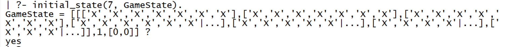
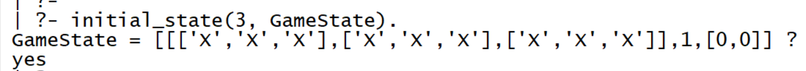
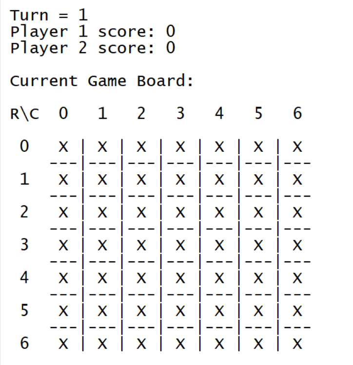
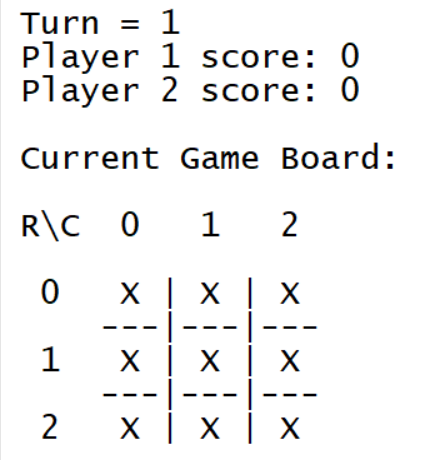
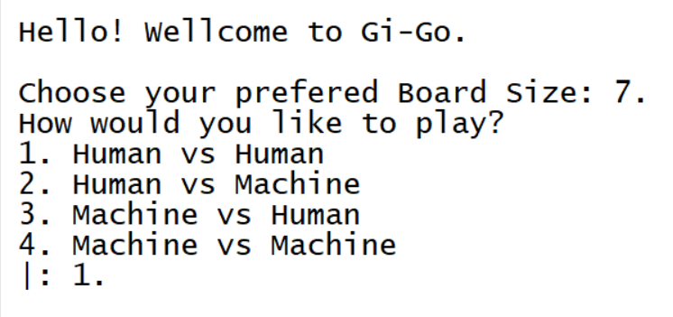
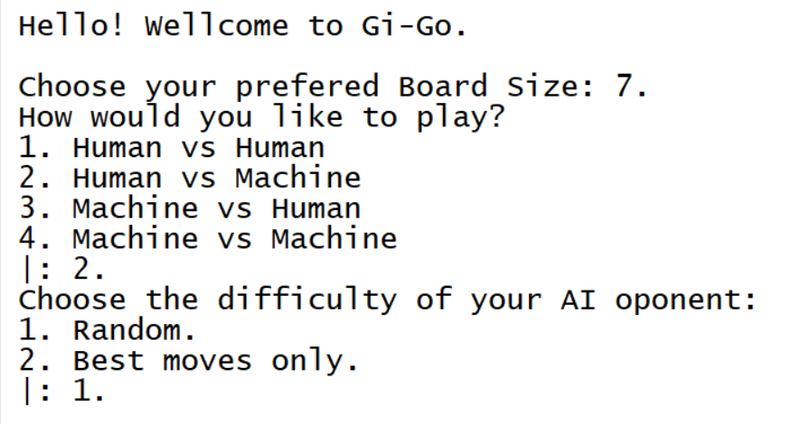

# GI-GO

Este jogo de tabuleiro foi realizado no ambito da disciplina de prolog, somos da turma 2 e somos o grupo Gi_GO_2.

### Developers:
| Nome | Número mecanografo | Divisão de trabalho |
|---|---|---|
| Amanda de Oliveira Silva | [up201800698](https://sigarra.up.pt/feup/pt/fest_geral.cursos_list?pv_num_unico=201800698)| 50% |
| Rafael Fernando Ribeiro Camelo | [up201907729](https://sigarra.up.pt/feup/pt/fest_geral.cursos_list?pv_num_unico=201907729) | 50% |

## Instalação e execução

Para jogar a nossa versão do *Gi-Go* apenas é necessário instalar o [SICStus Prolog 4.7](https://sicstus.sics.se) e, depois de consultar o ficheiro, correr o comando ``play``.


## Descrição do jogo

Gi-go é um jogo de tabuleiro para dois jogadores. Os jogadores devem colocar peças no tabuleiro, normalmente o tabuleiro de jogo é constituido 7x7 quadrados, alternando a vez entre si, o jogo acaba quando todos os quadrados esteja preenchidos. O objetivo do jogo é fechar o maior número possível de linhas horizontais, verticais ou diagonais, ou seja, colocar a última pedra nessa mesma linha, coluna ou diagonal. Se você fechar uma linha, obterá o número de campos na linha como pontos. Quando todos os campos estiverem ocupados, o jogador com mais pontos vence.
[Página do jogo](https://boardgamegeek.com/boardgame/348086/gi-go).


## Lógica do jogo

### Representação interna do estado do jogo 

* O estado do jogo é separado em três partes:
    1. O **tabuleiro**: é reprentado por um matrix de carateres. Inicialmente está preenchida com "X"s, que correspondem a um campo nao preenchido. O tamanho é escolhido pelo usuário.
    2. O **turno**: indica quem deve fazer a próxima jogada.
    3. Os **scores**: guarda a pontuação de cada jogador, na primeira posição está a pontuação do jogador 1 e na segunda a do jogador 2.


Estado inicial com tamanho de campo 7:




Estado inicial com tamanho de campo 3:



As peças de um jogador estão diferenciadas, apesar de não ser necessário. As peças colocadas pelo jogador 1 estão guardadas com um "1" e as do jogador 2 com um "2".

### Visualização do estado do jogo

A visualização do jogo é feita com recurso a uma função ``display_game(GameState)``. A representação visual do jogo constitui:
* A declaração do turno, ou seja, quem vai fazer a próxima jogada.
* Exposição da pontuação atual dos jogadores. 
* Desenho do campo de jogo atual, com indicação das linhas e colunas, espaços vazios estão marcados com um "X" e as jogadas com "1" ou "2" dependendo de quem a realizou.


Visualização de um jogo no estado inicial, tamanho do campo 7x7:




Visualização de um jogo no estado inicial, tamanho do campo 3x3:




Ao iniciar um novo jogo o usuário é apresentado com um menu. Neste menu é pedido que ele introduza o tamanho do tabuleiro, que escolha o modo de jogo e, caso seja necessário, escolha a dificuldade do computador.

Menu inicial do jogo, modo de jogo humano contra humano:



Menu inicial do jogo, modo de jogo humano contra máquina:




Para validar os inputs do usuário no menu utilizamos funções auxiliares que recebem o input do utilizador e confirmam se este está nos valores permitidos, por exemplo o campo tem um tamanho mínimo de 3 e máximo de 9. Caso seja realizado um input invalido é pedido outra vez o input ao usuário.


### Execução de jogadas
Para realizar uma jogada é necessário saber a linha e coluna da jogada pretendida, assim, é solicitado ao jogador que as insira, pedimos primeiro a linha e depois a coluna.

A validação do input é feita através da função ``is_valid_move`` que recebe a jogada e o campo de jogo atual, caso a jogada nao seja exequível é pedido para o jogador tentar jogar outra vez.

Um turno estará completo após ser calculado e somando o pontuação da jogada. A variável ``Turn`` é trocada para indicar o jogador seguinte.

````prolog
move([GameBoard, Turn, Score], Move, NewGameState) :-
    is_valid_move(GameBoard, Move),
    do_move(GameBoard, Move, Turn, NewGameBoard),
    calc_score(NewGameBoard, Move, Turn, Score, NewScore),
    NewTurn is (Turn mod 2) + 1,    
    NewGameState = [NewGameBoard, NewTurn, NewScore].
````

### Final do jogo

O jogo encontra-se encerrado quando nao houver mais campos vazios, ou seja, quando não houver mais jogadas validas. O vencedor será aquele com a maior pontuação.

```prolog
game_over(GameState, Winner):-
    valid_moves(GameState, ListOfMoves),
    length(ListOfMoves, 0),
    nth0(2, GameState, Scores),
    maximum_at(Scores, Max, Winner).

``` 


### Lista de jogadas válidas
Uma jogada será valida se o campo escollhido ainda não estiver preenchido.

Para isso percorremos o tabuleiro, e é verificado se o campo da jogada tem como valor "X".

```prolog
is_valid_move(GameBoard, [MoveX,MoveY]) :-
    nth0(MoveX, GameBoard, Row),
    nth0(MoveY, Row, Square),
    Square = 'X'.

valid_move([GameBoard,_,_], ValidMove) :-
    length(GameBoard, L),
    L1 is L - 1,
    between(0, L1, X),
    between(0, L1, Y),
    is_valid_move(GameBoard, [X, Y]),
    ValidMove = [X, Y].
    
valid_moves(GameState, ListOfMoves) :-
    findall(ValidMove, valid_move(GameState, ValidMove), ListOfMoves).
```

### Avaliação do estado do jogo

A avaliação de um estado de jogo do ponto de vista de um utilizador é bastante simples, apenas é necessário pegar no index do array ``Scores`` o index do jogador, por exemplo para o jogador 2 o valor de um determinado estado de jogo é a sua pontuação, que pode ser acedida da seguinta forma:

````prolog
nth1(2, Scores, P2Score).
````

### Jogada do computador

Há dois niveis de dificuldade para a jogada do computador 

#### Nível 1.
Jogadada escolhida de forma aleatoria atráves de da seleçao de uma jogada da 'ListOfMoves'.
```prolog
random_select(Moves, Move) :-
    length(Moves, Lenght),
    random(0, Lenght, Index), !,
    nth0(Index, Moves, Move).
```
```prolog
choose_move(1, _GameState, Moves, Move):-
random_select(Moves, Move).
```


#### Nível 2
Para o nível 2 é usado um algoritmo guloso, grid, em que é selecionado do set, ordenado por  que obtem a maior pontuçao,
```prolog
choose_move(2, GameState, Moves, Move):-
    setof(Value-Mv, NewState^( member(Mv, Moves),
        move(GameState, Mv, NewState), 
        evaluate_board(NewState, Value)), [_V-Move|_]).
```

## Conclusões

Em geral foi uma boa experiência realizar este trabalho, no âmbito que o tema do trabalho era interessante, é sempre bom conhecer mais jogos de tabuleiro e este era bastante fora do normal. Como iniciação a *Prolog* foi um bom trabalho permitindo entender como funcionam bastantes aspetos diferentes como a recursividade, atribuição de valor a uma variável, ASCII art entre muitos outros.

O único problema atualmente detetado, que por sua vez não é um problema de lógica de jogo, é o display visual antes da leitura de um input do jogador, isto é, aparece dois carateres extra antes de cada input do utilizador, "|:", obviamente, ainda não foi descoberta nenhuma solução.

Um *Roadmap* possível seria as seguintes melhorias:
* Correção do bug visual anteriormente descrito.
* Ampliação do jogo para permitar jogar 3 e 4 jogadores diferentes.
* Um sistema de base de dados que permita guardar a pontuação de cada jogador.
* A opçao um nível 3 de dificuldade, onde seria implementado um algoritmo MinMax para a obtecao de jogadas.
